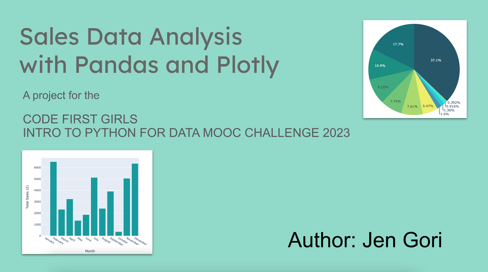

# Sales Data Analysis with Pandas and Plotly

### ** To view the project with tables and graphs correctly rendered go to [nbviewer](https://nbviewer.org/) and paste in this url: https://github.com/jengori/sales-data-analysis/blob/main/sales-data-analysis.ipynb **

This a a project completed for the **Intro To Python For Data** MOOC Challenge run by [Code First Girls](https://codefirstgirls.com) in April 2023.

## The brief

To write a Python program that reads in a csv file containing sales data, carry out analysis of the data, and write the results of the analysis to a csv file.

## Links

- To view the project with tables and graphs correctly rendered go to [nbviewer](https://nbviewer.org/) and paste in this url: https://github.com/jengori/sales-data-analysis/blob/main/sales-data-analysis.ipynb
- To view the presentation slides click [here](https://docs.google.com/presentation/d/e/2PACX-1vRGX326cTVWAsdKL-vKAK4-uEGEpLi8ArLKZcc-MhthamD1VruIzpQXwJk59rvSCiLm3PojT1mn4IA1/pub?start=false&loop=false&delayms=3000&slide=id.p)

